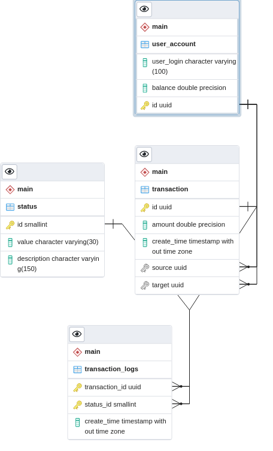

# Система транзакций

**Stack**: python, flask, postgresql, rabbitmq

### Схема БД

В БД 4 таблицы:

* user_account (содержит информацию о балансе пользователей)
* transaction (содержит список всех транзакций)
* transaction_logs (содержит список изменений состояний транзакций со временем)
* status (таблица, содержащие возможные статусы транзакций)

На данный момент в бд заведены следующие пользователи:

| id                                     | user_login | balance |
|----------------------------------------|------------|---------|
| "09a52b59-cdb0-41df-b0a3-b75885214cbe" | "test2"    | 5600    |
| "c8370a18-e61b-4c3e-89b8-d9a85e09c101" | "test1"    | 9400    |
| "ce32e0e3-5cea-4427-b386-479394251ccb" | "test3"    | 2000    |

### Логика работы

На сервер отправляется POST-запрос с данными транзакции, эта транзакция добавляется в БД в таблицы transaction и transaction_logs (со статусом "Pending"), а также добавляется в очередь в rabbitmq.
При обработке очередного сообщения в rabbitmq проверяется, есть ли у пользователей, участвующих в текущей транзакции, незавершенные до этого транзакции (проверка идет по таблице transaction_logs).
Если такие присутствуют, то сначала обрабатываются эти транзакции. В случае, если пользователю не хватает денег для перевода, то такая транзакция отклоняется со статусом 'Declined', в противном случае статус транзакции - "Success".

### Пример запроса: 

`curl -X POST http://localhost:5000/transaction -H 'Content-Type: application/json' -d '{"source":"c8370a18-e61b-4c3e-89b8-d9a85e09c101","target":"09a52b59-cdb0-41df-b0a3-b75885214cbe", "amount": 300}'`,
где `source` - идентификатор пользователя, который делает перевод. `target` - идентификатор пользователя, которому переводят деньги.